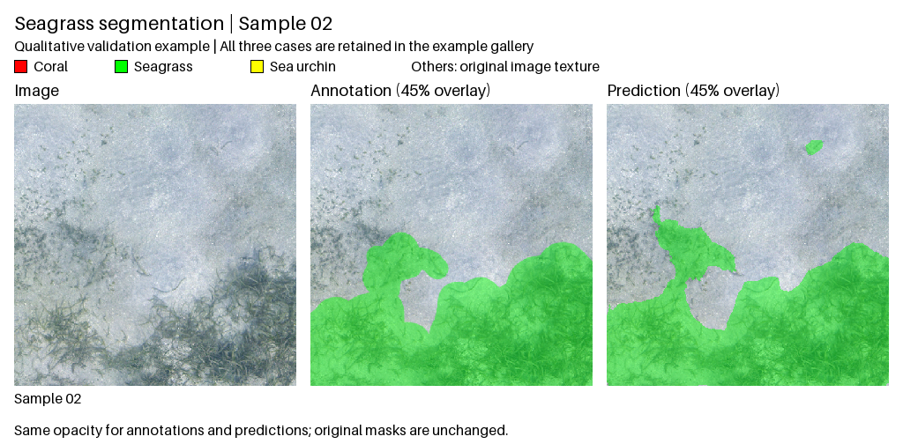
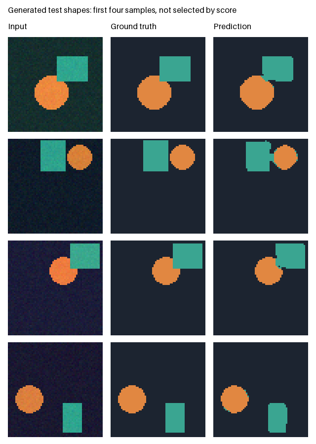

# 2d-segmentation

A compact Python toolkit for U-Net training, image preprocessing, inference, and
pixel-level segmentation evaluation. It packages general-purpose components from an image
segmentation project into small modules with explicit input contracts and CPU tests.

This is a **code portfolio**, not a pretrained segmentation product or a complete
research reproduction package. Only three authorized field example pairs are
included, with a qualitative baseline inference preview. The full research dataset,
model weights, unpublished methods, and research performance tables are not distributed.

## Real Seafloor Examples

One seagrass example with its supplied annotation and **actual U-Net prediction**.
This case is highlighted for readability, not as a representative performance result.



Annotation and prediction use the same 45% opacity so seabed texture remains
visible. The foreground regions come from the original annotation and raw
prediction; no smoothing or manual corrections were applied.

**What still fails:** this example has local boundary errors and small false-positive
regions. The mixed coral/urchin case also shows substantial coral over-segmentation.
[All three examples, including that difficult case](examples/field_samples/README.md),
remain available with their original annotations, unmodified prediction masks, and
inference notes.

The full three-image set was fixed before inference; only the homepage presentation
was selected afterward. Each image was excluded from its checkpoint's training
fold but used for validation checkpoint selection, **not independent testing**.
The generated-shape training demo below is separate; field-model weights are not bundled.

## Included

| Component | Implementation |
| --- | --- |
| Model | Four-level U-Net with batch normalization and nearest-neighbor upsampling |
| Training | Standard cross-entropy, separate validation transforms, early stopping, finite-state checks |
| Data | Strict image/mask pairing, label validation, cross-split duplicate-image detection |
| Preprocessing | LAB-luminance CLAHE, gamma correction, per-channel histogram matching |
| Inference | Strict state-dict loading, finite-value checks, class-index PNG output |
| Evaluation | Streaming confusion matrix, IoU, F1, precision, recall, pixel accuracy |
| Engineering | Installable package, CLI, generated end-to-end example, CPU tests and CI |

## Quick Start

Requires Python 3.10 or later. Run from the repository root:

```bash
python -m venv .venv
# Linux/macOS: source .venv/bin/activate
# Windows PowerShell: .venv\Scripts\Activate.ps1
python -m pip install -e .
python -m seg2d demo --output-dir runs/demo
```

The preprocessing demo does not require PyTorch, a GPU, a dataset, or a checkpoint.
Commands refuse to overwrite existing outputs; choose a new output path to rerun.
The installed `seg2d` entry point is equivalent to `python -m seg2d`.

### Train And Test A Small Example

```bash
python -m pip install -e '.[model]'
python -m seg2d train-demo --output-dir runs/train-demo
```

This command generates 48 training, 12 validation, and 12 test images of colored
shapes. It trains a small U-Net on CPU, selects the checkpoint using validation
loss, and only then evaluates the test split. No external dataset or pretrained
weights are downloaded. Outputs include `training/history.csv`,
`training/best.pt`, `test_metrics.json`, and `predictions.png`.



The preview shows the **first four test images**, not a score-selected subset.
It comes from the default 15-epoch command (data seed 17, training seed 7).
These colored shapes are deliberately easy and demonstrate the software workflow,
not real-world segmentation performance. Weights remain local and are not bundled.

### Train On Your Own Paired Images

Provide separate `train/images`, `train/masks`, `val/images`, and `val/masks`
directories. Pair images and PNG class-index masks by filename stem. Then run:

```bash
python -m seg2d train data/my_dataset runs/my_training --classes 3 --size 64 --base-channels 4
python -m seg2d predict input.png runs/my_training/best.pt runs/prediction.png --classes 3 --size 64 --base-channels 4
```

Match inference class count, model width, and resize size to your training config.
The small defaults are intended for development, not as a recommended research
configuration. Training is FP32; CPU is the default and CUDA requires `--device cuda`.
See [the training guide](docs/training.md) for data contracts, artifacts, and limitations.

### Preprocess An Image

```bash
python -m seg2d preprocess input.png runs/clahe.png --method clahe --clip-limit 2
python -m seg2d preprocess input.png runs/gamma.png --method gamma --gamma 0.8
python -m seg2d preprocess input.png runs/matched.png --method histogram --reference reference.png
```


This example contains **procedural shapes**, not field imagery or model predictions.
It illustrates transformations only; visual contrast improvement does not establish
better segmentation accuracy. The histogram reference is generated by the demo.

Inputs are 8-bit RGB or grayscale images. Alpha, palette, floating-point, and 16-bit
input images must be converted explicitly first. Processing uses RGB, not BGR.
Gamma follows `output = input ** gamma` on normalized values: gamma below one brightens.
CLAHE processes LAB luminance only. Histogram matching operates independently on
RGB channels and may change color relationships. These functions do not modify masks.

### Run U-Net Inference

Install PyTorch for your platform, then the optional model dependencies:

```bash
python -m pip install -e '.[model]'
python -m seg2d predict input.png checkpoints/weights.pt runs/labels.png --classes 4 --device cpu
```

Supply your own compatible checkpoint. Accepted formats are a plain PyTorch state
dictionary or `{"state_dict": ...}`. Class count and `--base-channels` must match the
checkpoint; keys and shapes are checked strictly. The default base width is 64.
Use `--base-channels 4` for a small development model, not as a research configuration.

Inference resizes RGB input to `--size 512` squared with bilinear interpolation,
runs the model in evaluation mode, and restores the original mask dimensions with
nearest-neighbor interpolation. Square resizing changes aspect ratio for nonsquare
images; preprocessing must match how your checkpoint was trained. Output contains
integer class IDs, not colors or calibrated probabilities. Classes must be 2 to 256.

Only load trusted checkpoints. `weights_only=True` reduces unsafe deserialization
exposure; it does not make arbitrary downloaded files trustworthy. Non-finite weights,
BatchNorm buffers, or model outputs are rejected rather than converted into labels.

### Evaluate Masks

```bash
python -m seg2d evaluate ground_truth.png runs/labels.png --classes 4
python -m unittest discover -s tests -v
```

Ground truth and predictions must be aligned class-index masks of identical shape.
Class IDs must lie in `[0, classes)`. Palette PNGs are read as indices, not RGB colors.
Macro averages include **every configured class**; a class absent in both masks
receives zero IoU/F1. No ignore label is assumed. See [design notes](docs/design.md)
before comparing with a benchmark that uses a different absent-class policy.

For multiple images, accumulate without storing all pixel predictions:

```python
from seg2d.metrics import ConfusionMatrix

metric = ConfusionMatrix(num_classes=4)
for target, prediction in aligned_mask_pairs:
    metric.update(target, prediction)
report = metric.compute()
```

## Layout

```text
src/seg2d/
  preprocessing.py   Image-only transformations
  model.py           U-Net building blocks and forward pass
  data.py            Paired datasets and split validation
  training.py        FP32 training and atomic checkpoint saving
  toy.py             Generated train/val/test data and training demo
  inference.py       Checkpoint validation and prediction
  metrics.py         Incremental confusion matrix and scores
  images.py          Image and label I/O validation
  demo.py            Procedural example generation
  cli.py             Command-line commands
tests/               Numerical, I/O, CLI, and model tests
docs/                Design decisions and scope
assets/              Procedural README illustration
examples/            Authorized field images, annotations, and qualitative predictions
.github/workflows/   CPU test configuration
```

## Scope And Attribution

The U-Net module is a refactored PyTorch implementation, not a new architecture.
It supports odd image sizes by aligning decoder tensors to skip-connection sizes.
This repository includes a generic training example, not the original research
training recipe. Research-specific augmentation, original data splits, private
files, and benchmark performance claims are excluded. Tests check software
behavior, not scientific effectiveness. Training and model tests require PyTorch.

- [U-Net, Ronneberger et al.](https://lmb.informatik.uni-freiburg.de/people/ronneber/u-net/)
- [OpenCV histogram equalization and CLAHE](https://docs.opencv.org/4.x/d5/daf/tutorial_py_histogram_equalization.html)
- [PyTorch checkpoint loading](https://docs.pytorch.org/docs/stable/generated/torch.load.html)

See [NOTICE.md](NOTICE.md) for provenance and the retained upstream license notice.
