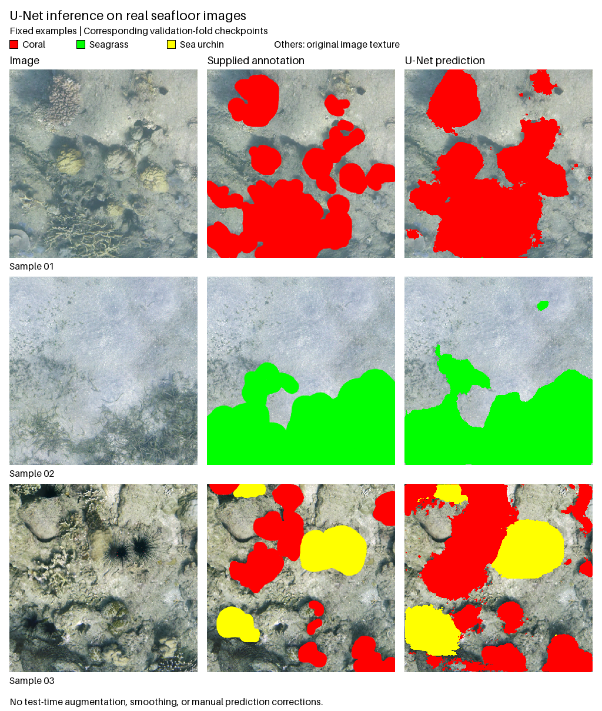

# Field Image Examples

Three image/annotation pairs from the maintainer's seafloor segmentation work are
included with permission for this repository's demonstration, together with
qualitative predictions from an existing U-Net baseline. The broader project's
provenance is described in [NOTICE.md](../../NOTICE.md).



The **middle column contains supplied RGB annotations**. The **right column
contains model predictions**, painted over the input for display. The unpainted
prediction regions represent class 0 (Others), not transparent or ignored predictions.

| Sample | Visible annotated content |
| --- | --- |
| `sample_01` | Coral |
| `sample_02` | Seagrass |
| `sample_03` | Sea urchin and coral |

Red marks coral, green marks seagrass, and yellow marks sea urchin. Other regions
retain image texture in these RGB annotation files. These files are annotation
visualizations, **not class-index masks**, and cannot be passed directly to the
generic trainer or `evaluate` command. No automatic RGB-to-class conversion is
provided here because interpreting unpainted and boundary pixels requires an
explicit annotation policy.

## Inference And Selection

The pairs were selected for visible annotated objects and little blank border and
published before any predictions were generated. All three were retained without
selection by model performance. They are not random or representative samples.

Predictions were generated with this repository's `seg2d.inference` module and
existing baseline checkpoints: four classes, base width 64, training seed 42.
Samples 01 and 02 use fold 3's checkpoint; sample 03 uses fold 1's checkpoint.
Each image is absent from the corresponding training partition. Validation-fold
membership was checked against frozen split manifests, and no exact image duplicate
was found in the corresponding training partition. This does not exclude near
duplicates or spatial correlation.

These are **within-survey validation examples**, not an independent test set:
the checkpoints were selected using their fold's monitoring validation loss.
Do not interpret this preview as an unbiased benchmark, evidence of spatial
generalization, or a comparison with other architectures. No aggregate scores
or model rankings are presented.

Inference used 512 x 512 RGB inputs divided by 255, evaluation mode, CPU float32,
and per-pixel argmax. There was no test-time augmentation, smoothing, component
filtering, or manual correction. The refactored model's logits matched the original
model exactly on these inputs, and repeated inference produced identical masks.
The stored predictions retain the original 512 x 512 resolution and class IDs
`0=Others, 1=Coral, 2=Seagrass, 3=Sea urchin`.

[`inference.json`](inference.json) records the setup, per-sample fold, and input,
checkpoint, and prediction hashes without private paths or original filenames.
Weights and the full dataset are not distributed, so the field predictions cannot
be independently regenerated from this repository alone. The generated-shape
example remains the self-contained end-to-end training demonstration.

To reconstruct the three-column visualization from the bundled prediction PNGs:

```bash
python examples/field_samples/make_inference_preview.py --output runs/field-inference-preview.png
```

To run inference with your own compatible four-class checkpoint:

```bash
python -m seg2d predict examples/field_samples/images/sample_01.png checkpoints/weights.pt runs/sample_01.png --classes 4 --base-channels 64 --size 512 --device cpu
```

This example command does not download weights or establish that your checkpoint
excluded the image from training.

## Source Files And Reuse

Exports retain the source RGB pixels and dimensions. Embedded metadata was removed
and original filenames replaced with neutral identifiers. No GPS coordinates,
collection timestamps, or original sample IDs are included. The preview is resized
only for presentation; the individual PNGs
preserve resolution. Original source files were not modified.

The permission to include these examples does not establish a general dataset
license. The upstream software MIT notice does not license these images. Contact
the maintainer before reuse or redistribution outside this repository.

The original [two-column image/annotation sheet](preview.png) is also retained.
To reproduce it from the six source PNGs:

```bash
python examples/field_samples/make_preview.py --output runs/field-preview.png
```
