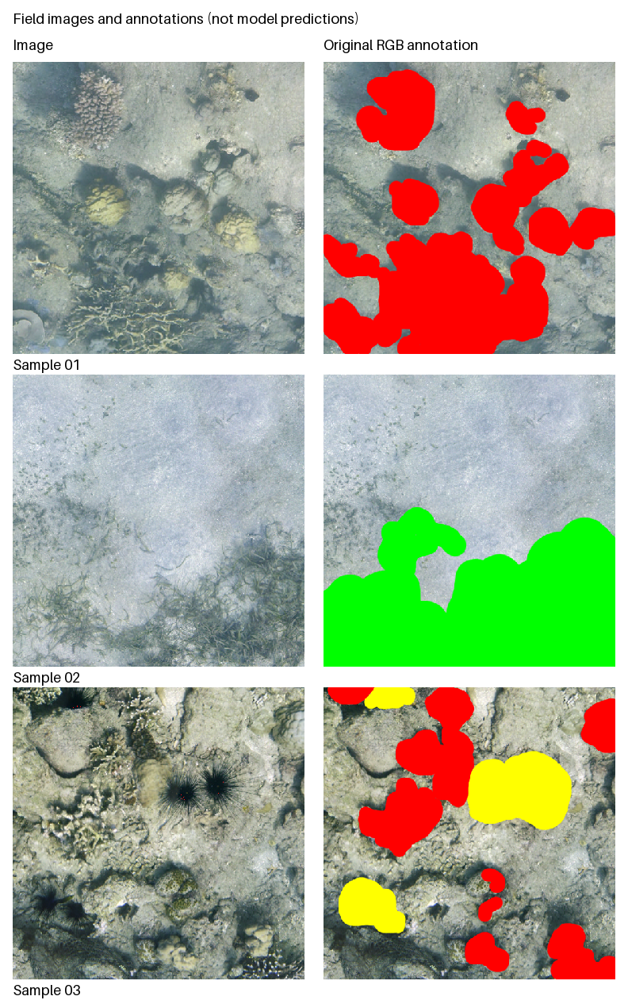

# Field Image Examples

Three image/annotation pairs from the maintainer's seafloor segmentation work are
included with permission for this repository's demonstration. These are real
images and supplied annotations, **not model predictions**. The broader project's
provenance is described in [NOTICE.md](../../NOTICE.md).



| Sample | Visible annotated content |
| --- | --- |
| `sample_01` | Coral |
| `sample_02` | Seagrass |
| `sample_03` | Sea urchin and coral |

Red marks coral, green marks seagrass, and yellow marks sea urchin. Other regions
retain image texture in these RGB annotation files. These files are annotation
visualizations, **not class-index masks**, and cannot be passed directly to the
generic trainer or `evaluate` command. No automatic RGB-to-class conversion is
provided here because interpreting unpainted and boundary pixels requires an
explicit annotation policy.

The pairs were selected for visible annotated objects and little blank border,
not model performance. They are not random or representative samples, and provide
no training/validation/test split or benchmark. The independent generated-shape
example remains the supported end-to-end training demonstration.

Exports retain the source RGB pixels and dimensions. Embedded metadata was removed
and original filenames replaced with neutral identifiers. No GPS coordinates,
collection timestamps, original sample IDs, model outputs, or paper results are
included. The preview is resized only for presentation; the individual PNGs
preserve resolution. Original source files were not modified.

The permission to include these examples does not establish a general dataset
license. The upstream software MIT notice does not license these images. Contact
the maintainer before reuse or redistribution outside this repository.

To reproduce the contact sheet from the six included PNGs:

```bash
python examples/field_samples/make_preview.py --output runs/field-preview.png
```
